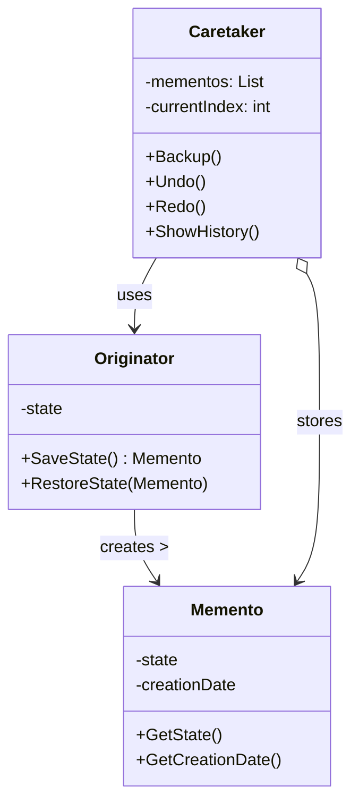

# Memento Pattern Implementation

This project demonstrates the Memento design pattern in C# with .NET 8. The Memento pattern allows you to save and restore the previous state of an object without revealing the details of its implementation, providing a clean way to implement undo/redo functionality.

## UML Diagram



The diagram shows the three key components of the Memento pattern:
- **Originator**: Creates mementos containing snapshots of its state and uses them to restore its state
- **Memento**: Stores the internal state of the Originator
- **Caretaker**: Manages the history of mementos but never modifies them

## Project Structure

```
MementoPattern/
├── Core/                           # Core interfaces and base classes
│   ├── IMemento.cs                 # Interface for all mementos
│   ├── IOriginator.cs              # Interface for all originators
│   └── Caretaker.cs                # Generic caretaker implementation
├── UseCases/
│   ├── SimpleExample/              # Basic text example
│   │   ├── TextMemento.cs          # Memento for text state
│   │   ├── TextOriginator.cs       # Originator for text content
│   │   └── SimpleExampleDemo.cs    # Demo runner for simple example
│   └── FormExample/                # Form fields example
│       ├── FormField.cs            # Represents a single form field
│       ├── FormMemento.cs          # Memento for form state
│       ├── FormOriginator.cs       # Originator for form
│       └── FormExampleDemo.cs      # Demo runner for form example
└── Program.cs                      # Main entry point
```

## Core Components

### IMemento Interface

The `IMemento` interface serves as a marker interface for all memento implementations:

```csharp
public interface IMemento
{
    DateTime GetCreationDate();
}
```

### IOriginator Interface

The `IOriginator<T>` interface defines the contract for objects that can save and restore their state:

```csharp
public interface IOriginator<T> where T : IMemento
{
    T SaveState();
    void RestoreState(T memento);
}
```

### Caretaker Class

The `Caretaker<T, M>` class manages the history of states and provides undo/redo functionality:

```csharp
public class Caretaker<T, M> where T : IOriginator<M> where M : IMemento
{
    private readonly List<M> _mementos = new();
    private readonly T _originator;
    private int _currentIndex = -1;
    
    // Methods for backup, undo, redo, and showing history
}
```

## Use Cases

### Simple Text Example

A basic implementation showing how to save and restore text content:

- `TextMemento`: Stores a string state
- `TextOriginator`: Manages a text state that can be saved and restored
- `SimpleExampleDemo`: Demonstrates changing text and undoing/redoing changes

### Form Example

A more complex implementation showing how to manage a form with multiple fields:

- `FormField`: Represents a single form field with ID, label, and value
- `FormMemento`: Stores the state of all form fields
- `FormOriginator`: Manages a form with multiple fields
- `FormExampleDemo`: Demonstrates filling out form fields sequentially and undoing/redoing changes

## Why Use a List for State Storage?

The implementation uses a `List<M>` to store states rather than a `Stack` for several important reasons:

1. **Bidirectional Navigation**: Lists allow both undo (backward) and redo (forward) operations by maintaining a current index pointer.

2. **State Preservation**: Unlike a stack where popped items are lost, a list preserves all states, allowing for navigation in both directions.

3. **History Management**: When a new action is performed after undoing, the implementation can truncate "future" states that would have been available for redo, which matches expected behavior in applications.

4. **Random Access**: Lists provide O(1) access to any state by index, which is useful for jumping to specific points in history.

## Running the Project

To run the project:

```bash
cd /path/to/MementoPattern
dotnet run
```

This will demonstrate both use cases:
1. The simple text example showing basic state management
2. The form example showing how to handle multiple fields with undo/redo functionality

## When to Use the Memento Pattern

- When you need to create snapshots of an object's state to restore it later
- When direct access to an object's fields would expose implementation details
- When implementing undo/redo functionality
- When implementing transaction rollbacks

## Benefits

1. Preserves encapsulation by not exposing the object's implementation details
2. Simplifies the originator code by letting the caretaker maintain the history
3. Provides a clean way to implement undo/redo functionality
4. Allows for flexible history management

## Drawbacks

1. Can consume a lot of memory if clients create many mementos
2. May require additional care in languages with reference-based objects
3. Caretakers should track the originator's lifecycle to destroy obsolete mementos

## Related Patterns

- **Command Pattern**: Commands can store states for undoing operations using mementos
- **Iterator Pattern**: Mementos can be used to capture and restore an iterator's state
- **Prototype Pattern**: Can be used as an alternative when the object's state is simple
