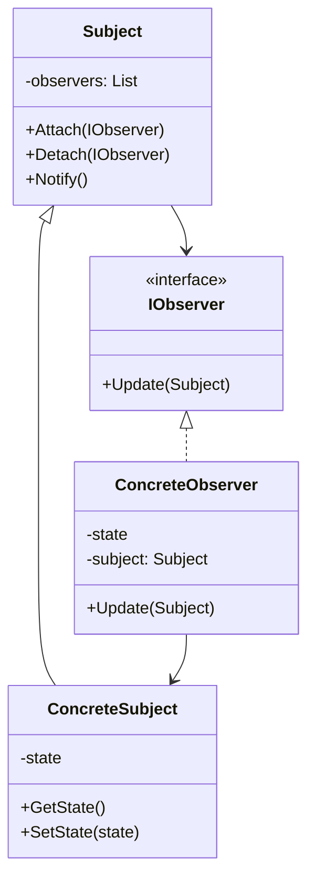

# Observer Pattern Implementation

This project demonstrates the Observer design pattern in C# with .NET. The Observer pattern defines a one-to-many dependency between objects so that when one object changes state, all its dependents are notified and updated automatically.

## UML Diagram

The diagram shows the key components of the Observer pattern:
- **Subject**: Maintains a list of observers and provides methods to attach, detach, and notify them
- **IObserver**: Interface that defines the update method for observers
- **ConcreteSubject**: Specific implementation of the subject that maintains state and notifies observers when it changes
- **ConcreteObserver**: Specific implementation of the observer that reacts to state changes in the subject

## When to Use the Observer Pattern

- When changes to one object require changing others, and you don't know how many objects need to change
- When an object should be able to notify other objects without making assumptions about who these objects are
- When a change to one object requires changing others, and you don't know how many objects need to be changed
- When an abstraction has two aspects, one dependent on the other, and encapsulating these aspects in separate objects lets you vary and reuse them independently

## Benefits

1. Open/Closed Principle: You can introduce new subscriber classes without having to change the publisher's code
2. Loose coupling between the subject and observers
3. You can establish relations between objects at runtime
4. Supports broadcast communication

## Drawbacks

1. Subscribers are notified in random order
2. Memory leaks can occur if observers aren't properly unregistered
3. Unexpected updates can occur when observers are notified in a cascade

## Related Patterns

- **Mediator Pattern**: By encapsulating complex update relationships, the mediator acts as an alternative to observer
- **Command Pattern**: Commands can be used to implement the update method in observers
- **Memento Pattern**: Can be used to restore state in observers
